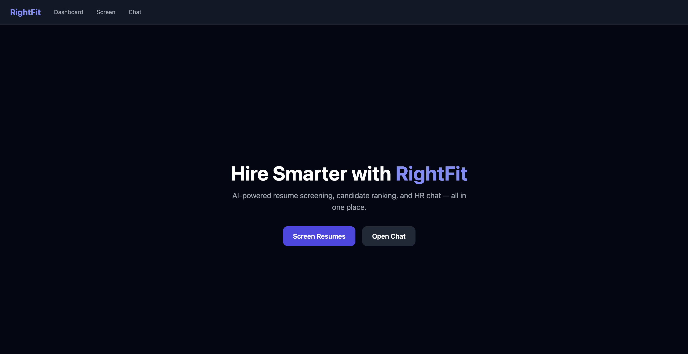
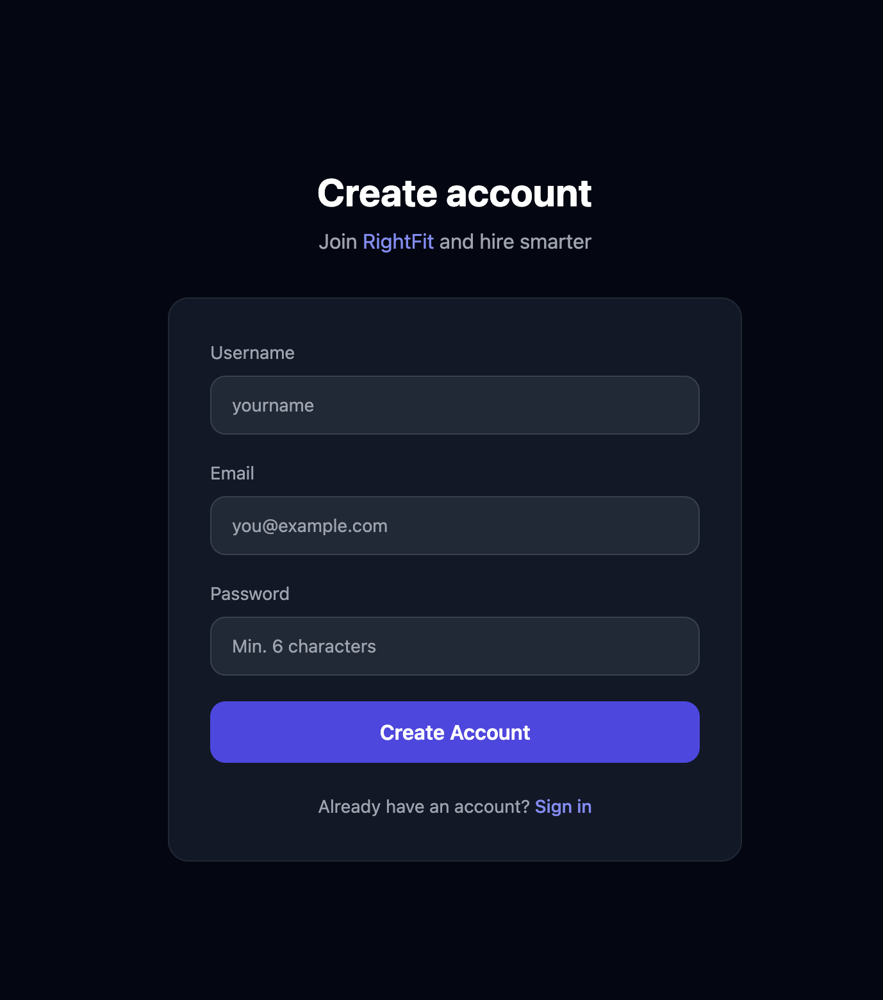
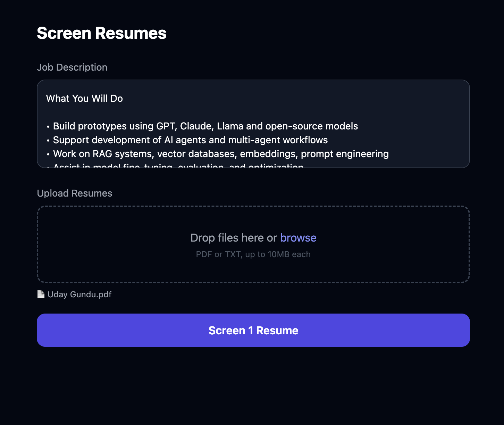
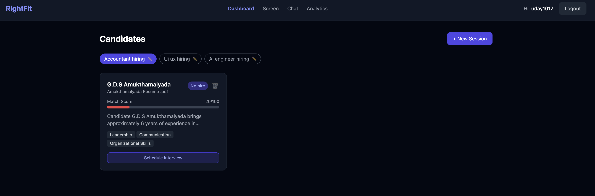
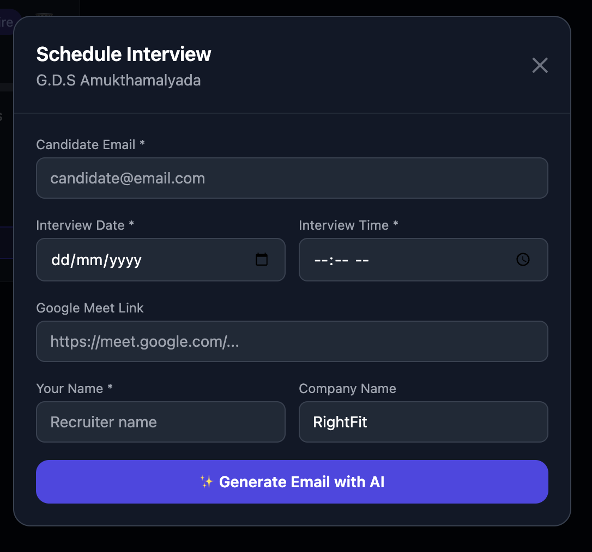
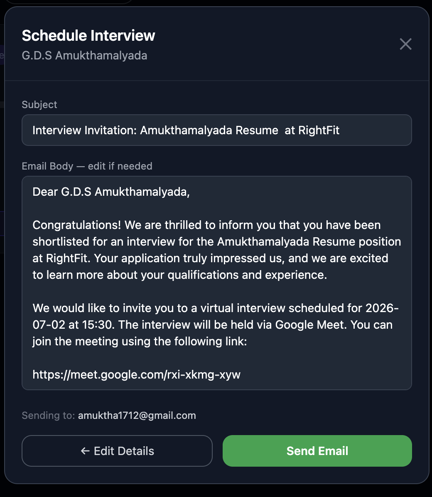
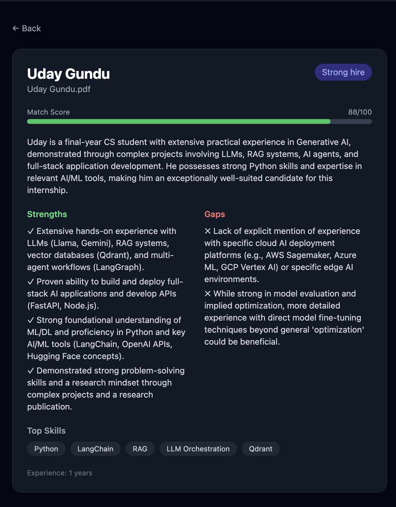
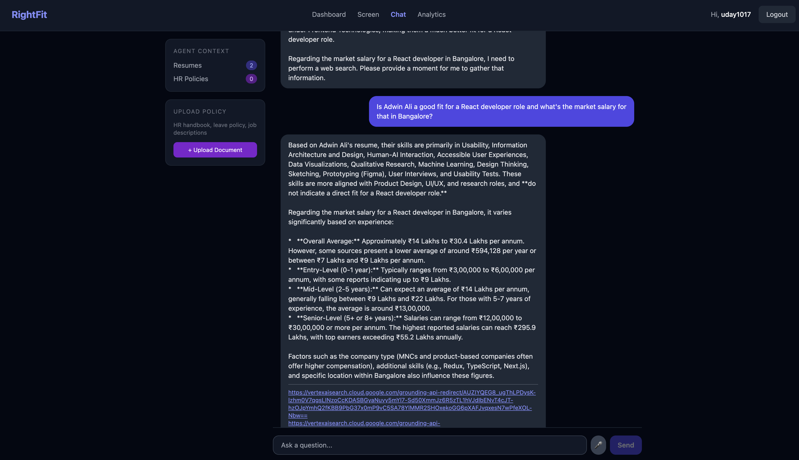
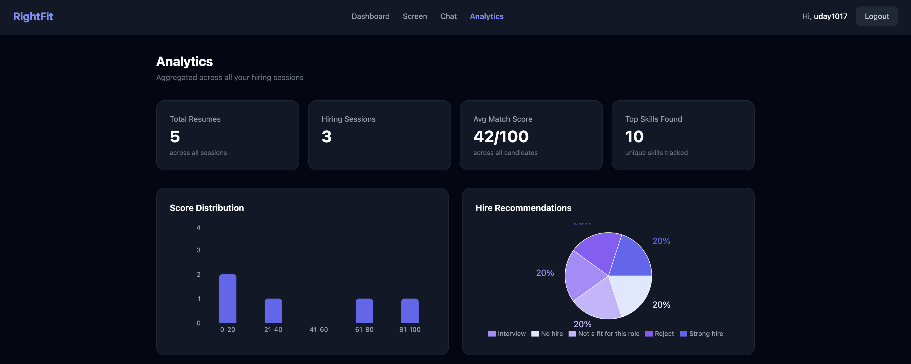
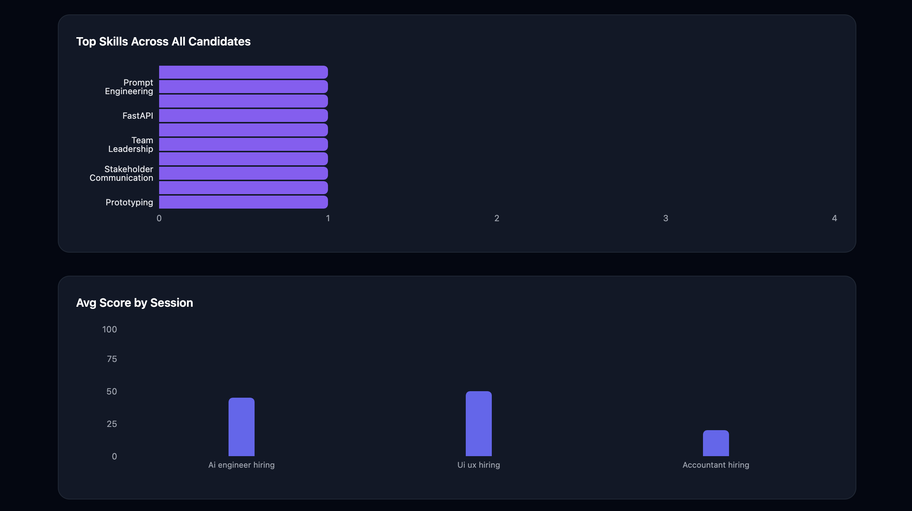

# RightFit : AI-Powered HR Agent

> An end-to-end intelligent HR agent that screens resumes, ranks candidates, schedules interviews, and answers HR questions using voice or text — powered entirely by Gemini AI.



---

## What it does

RightFit replaces manual resume screening with an AI agent that reads, understands, and ranks candidates against a job description in seconds. HR teams can then chat with the agent to ask questions about candidates, upload HR policy documents, get live market salary data, schedule interviews, and track hiring analytics — all in one place.

---

## Screenshots

| Screen | Preview |
|--------|---------|
| Landing |  |
| Register |  |
| Resume Screening |  |
| Candidate Dashboard |  |
| Schedule Interview |  |
| Send Mail |  |
| Candidate Detail |  |
| HR Chat |  |
| Analytics |  |
| Analytics 2 |  |

---

## Features

**Agentic OCR**
Upload any PDF resume — scanned or text-based. Gemini Vision doesn't just extract text — it understands the document and returns structured JSON: name, email, skills, experience timeline, education, certifications. This structured data feeds directly into the screening prompt for higher accuracy scores.

**AI Candidate Ranking**
Each resume gets a match score out of 100 with strengths, gaps, top skills, years of experience, and a hire recommendation — all generated by Gemini.

**Tool-Calling HR Agent (ReAct Loop)**
The chat is powered by a real agentic loop — not a classifier. Gemini receives 3 tools and decides which to call, in what order, and when it has enough to answer:
- `search_resumes` — semantic search over uploaded resumes via Qdrant
- `search_web` — live Google Search via Gemini Grounding
- `get_all_candidates` — returns structured summary of all candidates in session

**HR Policy Document Upload**
Upload company handbooks, leave policies, or job descriptions directly in the Chat page. The agent answers from both resumes and policy documents seamlessly in the same conversation.

**Interview Scheduling + Email**
Click "Schedule Interview" on any candidate card — fill in date, time, and Google Meet link — Gemini writes a professional invitation email — recruiter edits if needed — sends via Nodemailer directly to the candidate.

**Analytics Dashboard**
Aggregated across all hiring sessions: total resumes screened, average match score, score distribution chart, hire recommendation breakdown (pie chart), top skills across all candidates (bar chart), and average score per session comparison.

**Multiple Hiring Sessions**
Each user can create multiple isolated hiring sessions — Frontend Hiring, AI Engineer Hiring, Intern Recruitment — each with its own resumes, chat history, and job description. Sessions are renameable and persist across logins.

**Voice Input**
Click the mic button and speak your question. Browser-native Web Speech API converts it to text — no extra API cost.

**Persistent Data**
All resumes, chat history, and sessions are saved to MongoDB. Data survives logout and page refresh.

**User Authentication**
JWT-based auth with bcrypt password hashing. Each user gets a fully isolated workspace.

**LLM Observability with Langfuse**
Every Gemini call is traced — prompt, output, token count, latency, and cost — visible in the Langfuse dashboard at `http://localhost:3000`.

---

## How the AI pipeline works

```
Resume PDF
    ↓
Gemini Vision — Agentic OCR: extracts structured JSON
    { name, email, skills[], experience[], education[] }
    ↓
Gemini 2.5 Flash — scores candidate against job description
    ↓
MongoDB — stores structured data + screening results per session
Qdrant  — stores embeddings for semantic search

User Question (voice or text)
    ↓
Gemini 2.5 Flash — Tool-Calling Agent (ReAct loop)
    ↓
    ├── search_resumes  → Qdrant vector search (filtered by sessionId) → Gemini answers
    ├── search_web      → Gemini Grounding → live Google Search → answer
    └── get_all_candidates → structured candidate summary → Gemini answers
    (Gemini chains tools in sequence until it has enough to answer)
```

---

## Tech Stack

**Frontend**
- React + Vite
- Tailwind CSS
- Recharts (analytics charts)
- Lucide React (icons)
- Axios + React Router
- Web Speech API (voice input — browser native, no API cost)

**Backend**
- Node.js + Express
- Multer (file uploads)
- pdf-parse (text extraction)
- Nodemailer (interview email sending)
- MongoDB + Mongoose (session and chat persistence)
- Qdrant (vector database — sessionId-filtered semantic search)
- Langfuse (LLM observability — traces, tokens, latency)

**AI — All Gemini**
- `gemini-2.5-flash` — agentic OCR, resume screening, tool-calling chat, web grounding, email generation
- `gemini-embedding-001` — document embeddings for RAG

**Infrastructure**
- Docker + Docker Compose (one-command full stack setup)
- Nginx (frontend serving + API proxy in Docker)

---

## Project Structure

```
RightFit-HR Agent/
├── docker-compose.yml
├── backend/
│   ├── controllers/   # resumeController, chatController, analyticsController,
│   │                  # interviewController, policyController
│   ├── services/      # geminiService, ocrService, ragService, embeddingService
│   ├── models/        # Session, User
│   ├── routes/        # /api/resumes, /api/chat, /api/analytics,
│   │                  # /api/interview, /api/policies
│   ├── middleware/    # auth, upload, errorHandler
│   ├── utils/         # chunker, vectorStore, langfuse, helpers
│   └── server.js
└── frontend/
    ├── src/
    │   ├── pages/     # Landing, Screen, Dashboard, Candidate, Chat, Analytics
    │   ├── components/# Navbar, CandidateCard, ChatWindow, ScheduleModal,
    │   │              # FileUpload, VoiceButton, ScoreBar
    │   ├── hooks/     # useChat, useResumes, useVoice
    │   ├── context/   # AppContext
    │   └── services/  # api.js
    └── vite.config.js
```

---

## Quick Start

### Option A — Docker (one command)

```bash
git clone https://github.com/Uday1017/rightfit-hr-agent
cd rightfit-hr-agent

# create .env at project root
echo "GEMINI_API_KEY=your_key_here" > .env
echo "JWT_SECRET=your_jwt_secret_here" >> .env

docker compose up
```

Open [http://localhost](http://localhost)

---

### Option B — Manual

#### Prerequisites
- Node.js 18+
- MongoDB running locally
- Qdrant running locally (`docker run -p 6333:6333 qdrant/qdrant`)
- Gemini API key from [aistudio.google.com](https://aistudio.google.com)

#### 1. Clone and install

```bash
git clone https://github.com/Uday1017/rightfit-hr-agent
cd rightfit-hr-agent

cd backend && npm install
cd ../frontend && npm install
```

#### 2. Configure environment

```bash
# backend/.env
GEMINI_API_KEY=your_key_here
PORT=5001
MONGODB_URI=mongodb://localhost:27017/rightfit
JWT_SECRET=your_jwt_secret_here
QDRANT_URL=http://localhost:6333
EMAIL_USER=your_gmail@gmail.com
EMAIL_PASS=your_gmail_app_password
LANGFUSE_PUBLIC_KEY=
LANGFUSE_SECRET_KEY=
LANGFUSE_HOST=http://localhost:3000
```

#### 3. Start MongoDB

```bash
mkdir -p ~/data/db
mongod --dbpath ~/data/db
```

#### 4. Run

```bash
# Terminal 1
cd backend && npm run dev

# Terminal 2
cd frontend && npm run dev
```

Open [http://localhost:5173](http://localhost:5173)

---

## Usage

1. **Sign up** — create an account
2. **Sign in** — log in to your private workspace
3. Go to **Screen** — paste a job description and upload resumes
4. Click **Screen Resumes** — AI scores each candidate in seconds
5. View **Dashboard** — see all candidates ranked by match score; rename or switch sessions
6. Click **Schedule Interview** on any card — Gemini writes the email, you send it
7. Go to **Chat** — ask anything; upload HR policy docs for additional context
8. Go to **Analytics** — see score distribution, top skills, and session comparisons
9. Use the mic button to speak instead of typing

---

## Built by

**Uday Gundu** : AI Engineer
[github.com/Uday1017](https://github.com/Uday1017) · udaygundu17@gmail.com
