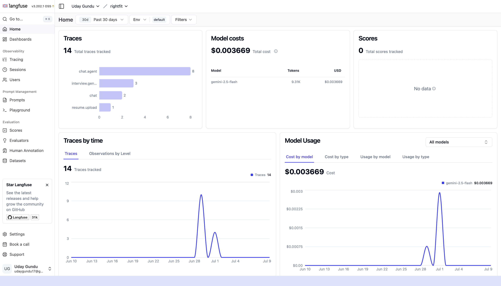

# RightFit : AI-Powered HR Agent

> An end to end intelligent HR agent that screens resumes, ranks candidates, schedules interviews, and answers HR questions using voice or text: powered entirely by Gemini AI.


---

## What it does

RightFit replaces manual resume screening with an AI agent that reads, understands, and ranks candidates against a job description in seconds. HR teams can then chat with the agent to ask questions about candidates, upload HR policy documents, get live market salary data, schedule interviews, and track hiring analytics, all in one place.

---

## Screenshots

| Screen | Preview |
|--------|---------|
| Landing |  |
| Register |  |
| Resume Screening |  |
| Candidate Dashboard |  |
| Schedule Interview |  |
| Send Mail |  |
| Candidate Detail |  |
| HR Chat |  |
| Analytics |  |
| Analytics 2 |  |
| Langfuse Observability |  |

---

## Features

**Agentic OCR**
Upload any PDF resume: scanned or text-based. Gemini Vision doesn't just extract text, it understands the document and returns structured JSON: name, email, skills, experience timeline, education, certifications. This structured data feeds directly into the screening prompt for higher accuracy scores.

**AI Candidate Ranking**
Each resume gets a match score out of 100 with strengths, gaps, top skills, years of experience, and a hire recommendation, all generated by Gemini.

**Tool-Calling HR Agent (ReAct Loop)**
The chat is powered by a real agentic loop, not a classifier. Gemini receives 3 tools and decides which to call, in what order, and when it has enough to answer:
- `search_resumes` : semantic search over uploaded resumes via Qdrant
- `search_web` : live Google Search via Gemini Grounding
- `get_all_candidates` : returns structured summary of all candidates in session

**HR Policy Document Upload**
Upload company handbooks, leave policies, or job descriptions directly in the Chat page. The agent answers from both resumes and policy documents seamlessly in the same conversation.

**Interview Scheduling + Email**
Click "Schedule Interview" on any candidate card, fill in date, time, and Google Meet link, Gemini writes a professional invitation email, recruiter edits if needed, sends via Nodemailer directly to the candidate.

**Analytics Dashboard**
Aggregated across all hiring sessions: total resumes screened, average match score, score distribution chart, hire recommendation breakdown (pie chart), top skills across all candidates (bar chart), and average score per session comparison.

**Multiple Hiring Sessions**
Each user can create multiple isolated hiring sessions: Frontend Hiring, AI Engineer Hiring, Intern Recruitment and each with its own resumes, chat history, and job description. Sessions are renameable and persist across logins.

**Voice Input**
Click the mic button and speak your question. Browser-native Web Speech API converts it to text which makes it no extra API cost.

**Persistent Data**
All resumes, chat history, and sessions are saved to MongoDB. Data survives logout and page refresh.

**Job Queue (BullMQ + Redis)**
Every uploaded resume becomes an independent job in a Redis-backed BullMQ queue. Workers process a maximum of 2 resumes concurrently — OCR and Gemini screening happen in the background. The frontend polls job status every 1.5 seconds and shows a real-time per-file progress bar. Failed jobs are automatically retried up to 3 times with exponential backoff. Uploading 100 resumes will never crash or timeout the server.

**Content Deduplication**
Each resume is SHA256 hashed after text extraction. If the same resume is uploaded twice across sessions, the cached screening result is returned instantly from Redis — no Gemini call, no re-processing. Cache TTL is 7 days. Same hash, different job description = different cache key, so cross-role reuse is handled correctly.

**Structured Output Enforcement**
All Gemini screening calls use JSON schema mode — `responseMimeType: application/json` with a typed schema. Gemini is constrained to return valid structured JSON every time. A separate schema validation retry loop (up to 2 retries) catches type mismatches independently of the 503/429 network retry logic.

**User Authentication**
JWT based auth with bcrypt password hashing. Each user gets a fully isolated workspace.

**LLM Observability with Langfuse**
Every Gemini call is traced: prompt, output, token count, latency, and cost, all visible in the Langfuse dashboard.

---

## LLM Observability — Langfuse

Every Gemini call in RightFit is traced end to end via Langfuse. The dashboard shows real-time visibility into the full AI pipeline — what prompts were sent, what came back, how many tokens were used, how long each call took, and what it cost.


**What gets traced:**

| Trace | What it tracks |
|---|---|
| `resume.upload` | OCR extraction + structured screening per resume |
| `chat.agent` | Full ReAct tool-calling loop — each tool call as a child span |
| `interview.generate` | Gemini email generation for interview scheduling |
| `chat` | Direct chat responses (web search or RAG) |

**Why this matters in production:**

Without observability, when an AI system returns a wrong answer or hallucination, you have no way to know what prompt caused it. Langfuse gives you the full trace — the exact prompt that went in, the exact response that came out, token count, latency, and cost — for every single request. You can drill into any trace and see exactly what the model saw and what it returned.

This is how production AI teams debug regressions, monitor prompt quality, and track costs before they spiral.

**Running Langfuse locally:**

```bash
git clone https://github.com/langfuse/langfuse.git
cd langfuse
docker compose up
```

Open [http://localhost:3000](http://localhost:3000), create a project, copy the keys into `backend/.env`:

```
LANGFUSE_PUBLIC_KEY=pk-lf-...
LANGFUSE_SECRET_KEY=sk-lf-...
LANGFUSE_HOST=http://localhost:3000
```

Langfuse keys are optional — if not set, the app runs normally without tracing.

---

## How the AI pipeline works

```
Resume PDF
    ↓
Gemini Vision: Agentic OCR: extracts structured JSON
    { name, email, skills[], experience[], education[] }
    ↓
SHA256 content hash → Redis cache check (dedup)
    ↓ cache miss
Gemini 2.5 Flash: scores candidate against job description
    (JSON schema mode — guaranteed structured output)
    ↓
MongoDB: stores structured data + screening results per session
Qdrant: stores embeddings for semantic search

User Question (voice or text)
    ↓
Gemini 2.5 Flash: Tool Calling Agent (ReAct loop)
    ↓
    ├── search_resumes  → Qdrant vector search (filtered by sessionId) → Gemini answers
    ├── search_web      → Gemini Grounding → live Google Search → answer
    └── get_all_candidates → structured candidate summary → Gemini answers
    (Gemini chains tools in sequence until it has enough to answer)
    ↓
Langfuse: traces every call → prompt, output, tokens, latency, cost
```

---

## Tech Stack

**Frontend**
- React + Vite
- Tailwind CSS
- Recharts (analytics charts)
- Lucide React (icons)
- Axios + React Router
- Web Speech API (voice input — browser native, no API cost)

**Backend**
- Node.js + Express
- Multer (file uploads)
- pdf-parse (text extraction)
- Nodemailer (interview email sending)
- MongoDB + Mongoose (session and chat persistence)
- BullMQ + Redis (job queue — controlled concurrency, retries, progress tracking)
- Qdrant (vector database — sessionId-filtered semantic search)
- Langfuse (LLM observability — traces, tokens, latency, cost)

**AI — All Gemini**
- `gemini-2.5-flash`: agentic OCR, resume screening (JSON schema mode), tool-calling chat, web grounding, email generation
- `gemini-embedding-001`: document embeddings for RAG

**Infrastructure**
- Docker + Docker Compose (one-command full stack setup)
- Nginx (frontend serving + API proxy in Docker)

---

## Project Structure

```
RightFit-HR Agent/
├── docker-compose.yml
├── backend/
│   ├── controllers/   # resumeController, chatController, analyticsController,
│   │                  # interviewController, policyController
│   ├── queues/        # resumeQueue, resumeWorker (BullMQ)
│   ├── services/      # geminiService, ocrService, ragService, embeddingService
│   ├── models/        # Session, User
│   ├── routes/        # /api/resumes, /api/chat, /api/analytics,
│   │                  # /api/interview, /api/policies
│   ├── middleware/    # auth, upload, errorHandler
│   ├── utils/         # chunker, vectorStore, resumeHashCache, langfuse, helpers
│   └── server.js
└── frontend/
    ├── src/
    │   ├── pages/     # Landing, Screen, Dashboard, Candidate, Chat, Analytics
    │   ├── components/# Navbar, CandidateCard, ChatWindow, ScheduleModal,
    │   │              # FileUpload, VoiceButton, ScoreBar
    │   ├── hooks/     # useChat, useResumes, useVoice
    │   ├── context/   # AppContext
    │   └── services/  # api.js
    └── vite.config.js
```

---

## Quick Start

### Option A — Docker (one command)

```bash
git clone https://github.com/Uday1017/rightfit-hr-agent
cd rightfit-hr-agent

echo "GEMINI_API_KEY=your_key_here" > .env
echo "JWT_SECRET=your_jwt_secret_here" >> .env

docker compose up
```

Open [http://localhost](http://localhost)

---

### Option B — Manual

#### Prerequisites
- Node.js 18+
- MongoDB running locally
- Redis running locally (`brew install redis && brew services start redis`)
- Qdrant running locally (`docker run -p 6333:6333 qdrant/qdrant`)
- Gemini API key from [aistudio.google.com](https://aistudio.google.com)

#### 1. Clone and install

```bash
git clone https://github.com/Uday1017/rightfit-hr-agent
cd rightfit-hr-agent

cd backend && npm install
cd ../frontend && npm install
```

#### 2. Configure environment

```bash
# backend/.env
GEMINI_API_KEY=your_key_here
PORT=5001
MONGODB_URI=mongodb://localhost:27017/rightfit
JWT_SECRET=your_jwt_secret_here
REDIS_HOST=localhost
REDIS_PORT=6379
QDRANT_URL=http://localhost:6333
EMAIL_USER=your_gmail@gmail.com
EMAIL_PASS=your_gmail_app_password
LANGFUSE_PUBLIC_KEY=
LANGFUSE_SECRET_KEY=
LANGFUSE_HOST=http://localhost:3000
```

#### 3. Start MongoDB

```bash
mkdir -p ~/data/db
mongod --dbpath ~/data/db
```

#### 4. Run

```bash
# Terminal 1
cd backend && npm run dev

# Terminal 2
cd frontend && npm run dev
```

Open [http://localhost:5173](http://localhost:5173)

---

## Usage

1. **Sign up** : create an account
2. **Sign in** : log in to your private workspace
3. Go to **Screen** : paste a job description and upload resumes
4. Click **Screen Resumes** : AI scores each candidate in seconds
5. View **Dashboard** : see all candidates ranked by match score; rename or switch sessions
6. Click **Schedule Interview** on any card : Gemini writes the email, you send it
7. Go to **Chat** : ask anything; upload HR policy docs for additional context
8. Go to **Analytics** : see score distribution, top skills, and session comparisons
9. Use the mic button to speak instead of typing

---

## Built by

**Uday Gundu**
[github.com/Uday1017](https://github.com/Uday1017) · udaygundu17@gmail.com